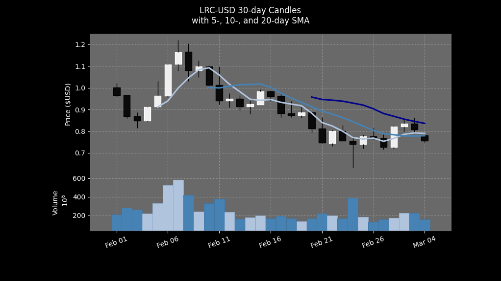
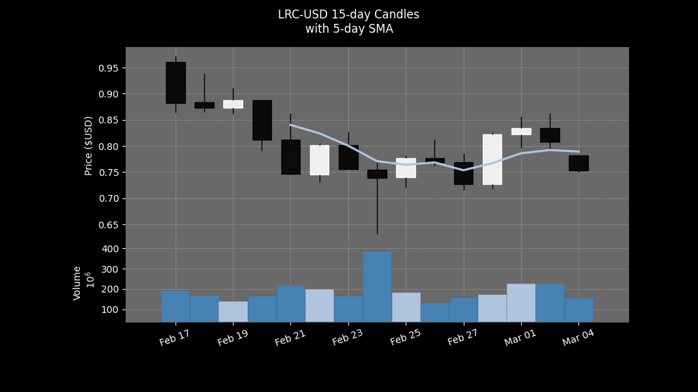
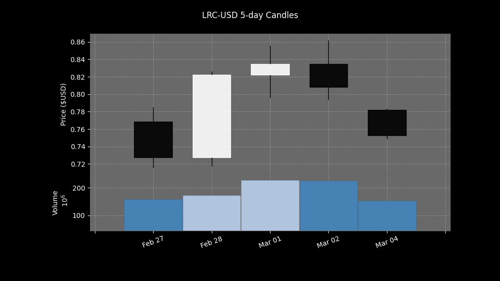
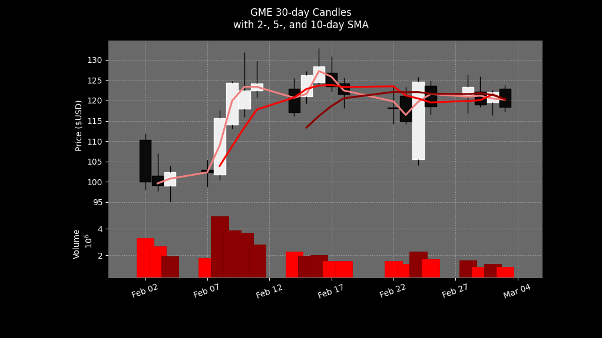

# LRC and GME Chart Generator API

This API is a fake way to create dynamic NFTs on Layer 2, or "Fauxnamics" if you will, until we have the full minting functionality available.

This API utilizes the [mplfinance](https://github.com/matplotlib/mplfinance) module to generate and style the charts.

A new chart is generated every hour for each endpoint.

Current endpoints are:

| Endpoint      | Description                              |
|---------------|------------------------------------------|
| `/lrc`        | returns the current 30-day chart for LRC |
| `/lrc-15-day` | returns the current 15-day chart for LRC |
| `/lrc-5-day`  | returns the current 5-day chart for LRC  |
| `/gme`        | returns the current 30-day chart for GME |

## Chart Examples

### Loopring - LRC 30-day

### GameStop - GME

