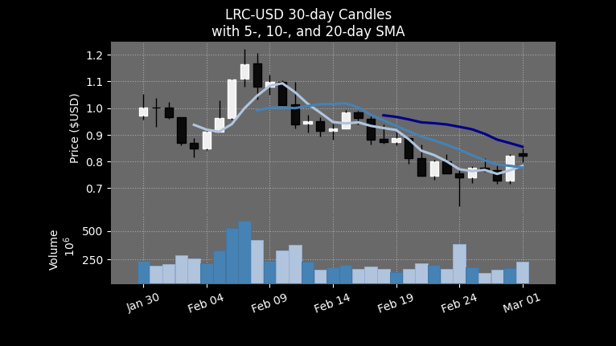
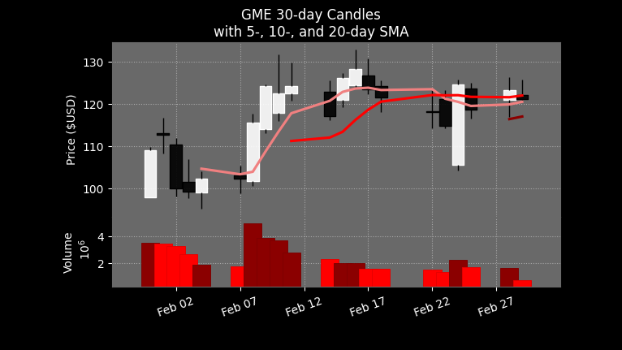

# LRC and GME Chart Generator API

This API is a fake way to create dynamic NFTs on Layer 2 until we have the full minting functionality available using [`mplfinance` from `matplotlib`](https://github.com/matplotlib/mplfinance).

Every hour the API will generate a new chart for GME and LRC for serving on each call to the interface.

Current endpoints are:

* `/lrc` - returns the current 30-day chart for LRC
* `/gme` - returns the current 30-day chart for GME

## Chart Examples

### Loopring - LRC

### GameStop - GME

